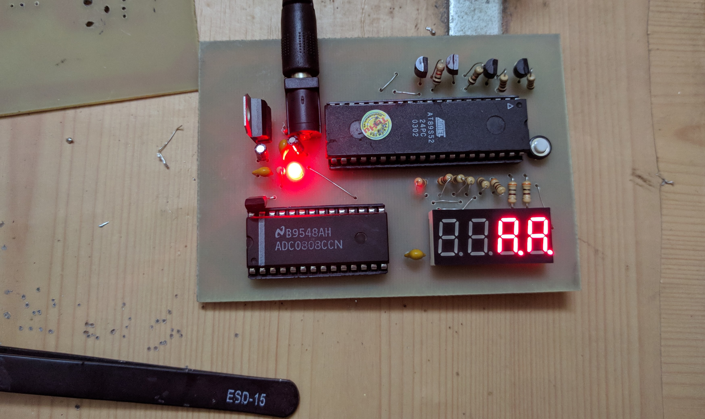
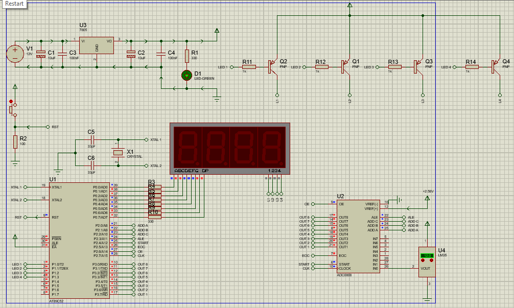

## Digital Thermometer using 8051 Microcontroller
Last semester, I had exercise about [analogue-electronics](https://en.wikipedia.org/wiki/Analogue_electronics). I decided to build a thermoneter following this [instuction](https://mualinhkien.vn/chi-tiet-bv/mach-su-dung-vi-dieu-khien-ho-8051-do-nhiet-do-hien-thi-led-7-thanh-dung-cam-bien-lm35.html). At the end, it didn't work but I learnt some interesting things:
- Several electronic components: 8051, ADC0808, LM35, LM7805
- Circuit simulation using Proteus.
- Programming 8051 by C lang.
- Analog-to-digital operating.  

Photos:  

